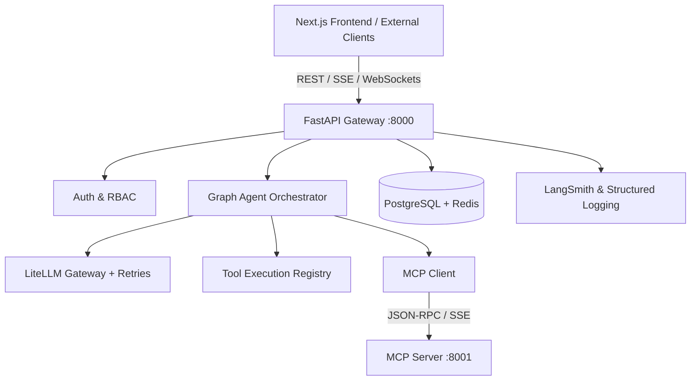

# Enterprise Agentic AI Platform

[](https://fastapi.tiangolo.com)
[](https://python.org)
[](https://docs.pydantic.dev)
[](https://peps.python.org/pep-0008/)

## 1. Project Purpose

The **Enterprise Agentic AI Platform** is a production-grade, extensible framework engineered for autonomous enterprise agents. It delivers enterprise-ready reliability, security, multi-model LLM routing, and asynchronous state-machine workflows.

### Planned Platform Capabilities
- **FastAPI Backend**: Async, typed, high-throughput REST & streaming API gateway.
- **PostgreSQL & Redis**: Hybrid state persistence, session caching, and pub/sub messaging.
- **Security & RBAC**: JWT authentication, fine-grained role-based access control, and tenant isolation.
- **MCP Client/Server Architecture**: Model Context Protocol integration for dynamic enterprise tool discovery and context grounding.
- **Graph/State-Based Agent Orchestration**: Graph-based cyclical reasoning, state persistence, and human-in-the-loop validation.
- **LiteLLM Gateway**: Multi-provider resilience with automatic fallbacks, rate-limit retries, exponential backoff, and jitter.
- **Observability & Evaluation**: OpenTelemetry and LangSmith tracing, audit logging, and automated eval benchmarks.
- **Next.js Frontend**: Real-time conversational interface with streaming responses and execution graph visualization.

---

## 2. High-Level Architecture

The platform follows a clean **Monorepo** design dividing concerns into three isolated domains:

```
Enterprise-Agent/
├── backend/            # Core FastAPI backend, agents, LLM, auth & observability
├── mcp-server/         # Model Context Protocol server (tools & resource provider)
├── frontend/           # Next.js conversational web interface
├── .env.example        # Root environment template
└── .gitignore          # Repository git ignore rules
```

### Monorepo Structure



### Phase 1: Architectural Foundation

Phase 1 establishes the rock-solid foundational core without premature complexity:
- Modular package boundaries (`api`, `agent`, `auth`, `llm`, `mcp`, `database`, `tools`, `evaluation`, `observability`).
- Immutable configuration management using `pydantic-settings`.
- Structured JSON logging with standardized fields (`timestamp`, `level`, `module`, `function`, `line_number`, `extra`).
- Zero-overhead `/health` liveness probe.
- Fully typed Python code with complete `pytest` coverage.

---

## 3. Directory Layout & Package Roles

```
backend/
├── app/
│   ├── __init__.py
│   ├── main.py                     # FastAPI application factory, lifespan, CORS, middleware
│   ├── core/
│   │   ├── __init__.py
│   │   ├── config.py               # Pydantic Settings (BaseSettings)
│   │   └── logging.py              # Structured JSON logging formatter & handler setup
│   ├── api/
│   │   ├── __init__.py
│   │   ├── router.py               # Master API router (/api)
│   │   └── v1/
│   │       ├── __init__.py
│   │       ├── router.py           # v1 API router (/api/v1)
│   │       └── endpoints/
│   │           ├── __init__.py
│   │           └── health.py       # Health check schema & endpoint implementation
│   ├── agent/                      # Graph- & state-based agent orchestration workflows
│   ├── auth/                       # JWT authentication, token decoding, and RBAC
│   ├── llm/                        # LiteLLM client, streaming, retries, jitter
│   ├── mcp/                        # Model Context Protocol (MCP) client & transport
│   ├── database/                   # PostgreSQL async engine, Redis clients, Alembic
│   ├── tools/                      # Tool registry, schemas, and execution sandboxes
│   ├── evaluation/                 # LangSmith datasets, evals, and benchmark suites
│   └── observability/              # Distributed tracing, OpenTelemetry, audit logs
├── tests/
│   ├── __init__.py
│   ├── conftest.py                 # Pytest fixtures and test dependency overrides
│   └── test_health.py              # Health check unit and integration tests
├── .env.example                    # Environment variable template
├── pyproject.toml                  # Project metadata, build settings, and pytest config
├── requirements.txt                # Pinned production and test dependencies
└── README.md                       # Backend specific documentation
```

---

## 4. Getting Started

### Prerequisites
- Python 3.11 or higher
- Git

### 1. Clone the Repository
```bash
git clone https://github.com/Vikas9892/Enterprise-Agent.git
cd Enterprise-Agent
```

### 2. Set Up Python Virtual Environment
```bash
# Navigate to the backend directory
cd backend

# Create virtual environment
python -m venv .venv

# Activate virtual environment
# Windows (PowerShell):
.venv\Scripts\Activate.ps1
# Linux / macOS:
# source .venv/bin/activate
```

### 3. Install Dependencies
```bash
pip install --upgrade pip
pip install -r requirements.txt
```

### 4. Configure Environment Variables
```bash
cp .env.example .env
```
*(On Windows PowerShell, use `Copy-Item .env.example .env`)*

---

## 5. Running the Application

### Start the FastAPI Development Server
```bash
# From within the backend/ directory with .venv active:
python -m uvicorn app.main:app --host 0.0.0.0 --port 8000 --reload
```
Alternatively, run directly with Python:
```bash
python -m app.main
```

The application will start on `http://localhost:8000`.

### Interactive API Documentation
- **Swagger UI**: [http://localhost:8000/docs](http://localhost:8000/docs)
- **ReDoc UI**: [http://localhost:8000/redoc](http://localhost:8000/redoc)
- **OpenAPI Schema**: [http://localhost:8000/openapi.json](http://localhost:8000/openapi.json)

---

## 6. Verifying the Health Endpoint

### Direct Root Check:
```bash
curl -X GET http://localhost:8000/health
```

### Versioned API Check:
```bash
curl -X GET http://localhost:8000/api/v1/health
```

**Expected JSON Response (HTTP 200 OK):**
```json
{
  "status": "healthy",
  "app_name": "Enterprise Agent Platform",
  "version": "0.1.0",
  "environment": "development"
}
```

---

## 7. Running Database Migrations & Seeding

### Apply Alembic Migrations
```bash
# Apply all pending schema migrations
alembic upgrade head
```

### Seed Demo Data
Populate the database with enterprise customers, products, inventory, orders, invoices, support tickets, users, and RBAC roles:
```bash
python scripts/seed_data.py
```

---

## 8. Running the Test Suite

Execute the full suite covering API endpoints, database models, and repository operations:

```bash
# From within the backend/ directory with .venv active:
pytest -v
```

To run with concise output:
```bash
pytest -ra -q
```

---

## 9. Phase Evolution Roadmap

| Phase | Milestone | Status | Description |
| :--- | :--- | :--- | :--- |
| **Phase 1** | **Foundation** | Done | Clean monorepo, FastAPI skeleton, Pydantic settings, structured logging, tests |
| **Phase 2** | **Database & Domain Foundation** | Done | PostgreSQL, SQLAlchemy 2.x, Alembic, 11 models, 8 repositories, migrations & seed |
| **Phase 3** | **Security & Authentication** | Planned | JWT authentication, password hashing, RBAC token verification dependencies |
| **Phase 4** | **LLM Gateway & MCP** | Planned | LiteLLM routing, exponential backoff with jitter, MCP client and MCP server |
| **Phase 5** | **Agent Orchestrator** | Planned | State-machine/graph orchestration, cyclical reflection loops, tool calling |
| **Phase 6** | **Observability & Eval** | Planned | LangSmith tracing, OpenTelemetry, audit logging, evaluation datasets |
| **Phase 7** | **Frontend Experience** | Planned | Next.js chat interface, streaming SSE, tool execution trace UI |

---

## 9. License & Authorship

- **Author**: vikas9892 ([vikast4843@gmail.com](mailto:vikast4843@gmail.com))
- **Repository**: [https://github.com/Vikas9892/Enterprise-Agent](https://github.com/Vikas9892/Enterprise-Agent)
